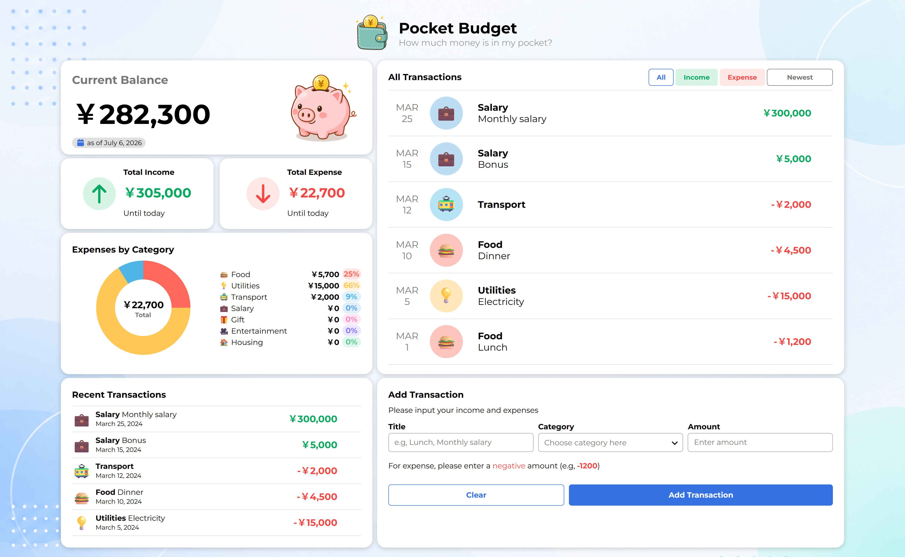
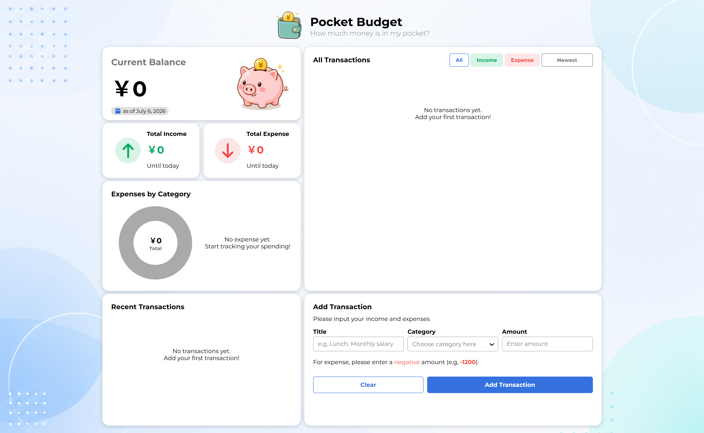
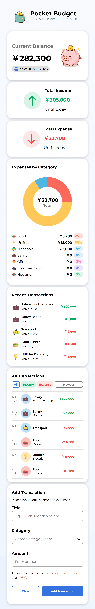
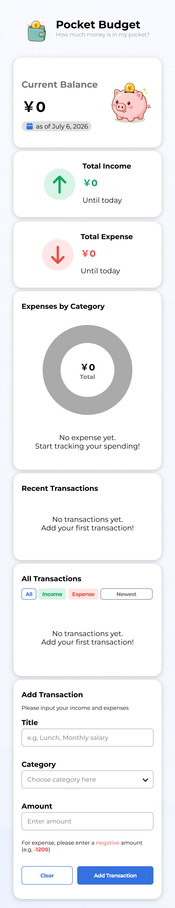

# Pocket Budget

## 📝 Description

Pocket Budget is a responsive web application for tracking income and expenses.

It provides an intuitive dashboard with category charts, transaction filtering, sorting, and persistent data using Local Storage.

## 💡 Why I Built This

I built Pocket Budget to practice JavaScript by developing a complete CRUD-style application with responsive UI, modular architecture, and persistent data storage.

This project focuses on writing maintainable code while improving UI/UX and responsive design.

## 🧠 Learning Points

- Modular JavaScript architecture
- Local Storage persistence
- Responsive layout using CSS Grid & Flexbox
- Dynamic rendering with reusable functions
- Category-based data aggregation and chart visualization

## 🌐 Live Demo

👉 https://pocket-budget-eehara.netlify.app/

## 📸 Screenshots

### Desktop

**Has Data**


**Empty Data**


### Mobile

<table>
  <tr>
    <th>Has Data</th>
    <th>Empty Data</th>
  </tr>
  <tr valign="top">
    <td>
      
    </td>
    <td>
      
    </td>
  </tr>
</table>

## 🚀 Features

- 📊 Dashboard
  - Displays current balance, total income, and total expense.

- 🧩 Category Chart
  - Visualizes expense distribution by category.

- 🔍 Transaction Filter
  - Filter transactions by All, Income, or Expense.

- ↕️ Transaction Sort
  - Sort transactions by date or amount.

- 📱 Responsive Design
  - Optimized for desktop and mobile devices.

- 💾 Local Storage
  - Automatically saves transactions in the browser.

## 🛠 Tech Stack

- HTML5
- CSS3
- JavaScript (ES6 Modules)
- Local Storage API
- Netlify

## 📂 Project Structure

```text
pocket-budget/
├── assets/
├── img/
├── js/
│   ├── categories.js
│   ├── dummy-data.js
│   ├── formatter.js
│   ├── storage.js
│   ├── utils.js
│   └── script.js
├── index.html
├── style.css
├── LICENSE.md
└── README.md
```

## 🔧 Planned Improvements

- Monthly budget management
- Custom transaction date
- Edit transactions
- Category management
- Currency switching
- Toast notifications
- Dark mode

## 📄 License

This project is licensed under the MIT License.
